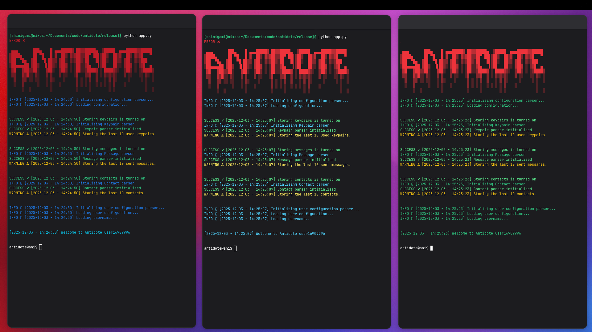

# Antidote - Message Encryption Client

  

> [!CAUTION]
> Antidote is currently a proof of concept I put together in about a month for a school project, do **not** treat it as a secure communication platform. It’s a learning project, not a military-grade cipher. This comes with zero warranty, and ***I do not condone or endorse illegal or malicious activity.***

## Why should you care?

Honestly? Because I don’t.  
Talk about aliens, send your Fortnite strats, confess your sins, whatever.  
Antidote makes sure nobody else is peeking.

This isn’t another messaging app.  
It’s a protest against forced identification and chat surveillance.  
No sign-ins. No phone numbers. No cloud.  

***Just math and silicon.***

## About

Antidote currently uses very minimal encryption — mostly XOR operations. The goal of this project was to explore the basics of end-to-end encryption: generating keypairs, encrypting and decrypting data, and experimenting with secure routing systems like the Tor protocol. I wasn’t trying to reinvent Signal or Whatsapp in a month, I don’t have the time, the resources, or the brain cells for that.

This project was started (and is currently), as a school assignment, and is a requirement for me to finish my current school, and move on with my studies. This **personal project** helped me develop a lot not only as a student, by taking my learning into my own hands, but also as a programmer.

Antidote uses a custom, stripped-down version of the ed25519 algorithm to generate user keypairs. Why ed25519? I needed something simple, fast, and usable for generating user identifiers. ed25519 allows deriving a public key from a private key, which makes it ideal for integrating into a future desktop application. Private keys can be stored locally, and public keys can be derived quickly when needed.
These keypairs are intended to be single-use.

It isn't the most efficient, or the best code ever written, but it works, and I am satisfied with how this project is going so far. Feel free to skim through the code (the release folder). I have split the core of this tool into separate files, as I was focusing on maintainability, scalability, repairability and modularity. In simple terms; I wanted every part of this to work on its own, without relying on something else, and being very modular, so for example I could easily swap in a better encryption system, without having to rewrite the entire tool.

Antidote currently has zero external requirements — just a device that can run Python.

### Outline of the project

```
antidote/
├── release/
│ ├── core/
│ │    ├─ __init__.py
│ │    ├─ cli.py
│ │    ├─ colours.py
│ │    ├─ ed25519.pu
│ │    ├─ encryption.py
│ │    ├─ parsers.py
│ │    └─ qrcode.py
│ ├── data/
│ │    ├─ conf.config
│ │    ├─ contacts.json
│ │    ├─ keypairs.json
│ │    ├─ messages.json
│ │    ├─ themes.config
│ │    └─ user.config
│ ├── expirimental/         # work in progress (will NOT be updated)
│ │    ├─ __init__.py
│ │    └─ networking.py     # tor networking
│ └ app.py                  <== actuall cli client
│
├── src/
│ ├── core/
│ │    ├─ encryption.py
│ │    ├─ decryption.py
│ │    └─ ed25519.py
│ ├── network/              # once again, work in progress
│ └── docs/                 # assets for README
│
├── README.md
├── LICENCE
├── .gitignore
└── requierments.txt
```

## Usage guide

1. Download the release folder from the repo.

2. (Optional) Move it somewhere private or secure.

3. Install Python if you haven’t already:
    https://www.python.org/downloads/

4. Run app.py. (`python app.py` in the release folder)

That's it.

## Commands

These are all of the commands that are currently implemented into the antidote client:

```
"help": "returns all commands",
"econf": "edit client configuration",
"euconf": "edit user configuration",
"etheme": "edit theme",

"npair": "generates a new keypair",
"encrypt": "encrypt a message",
"dcrypt": "decrypt a message",

"tmsg": "makes a test message",

"kpshow": "shows saved keypairs",
"kpimport": "import a keypair or public key",
"kpexport": "export a keypair or public key",
"kpdel": "delete a saved keypair",

"msgshow": "shows saved messages",
"msgdel": "delete a saved message",

"ctshow": "shows saved contacts",
"ctadd": "add a new contact",
"ctremove": "remove a saved contact",
"ctupdate": "update a saved contact",

"backup": "export all data to a backup file",
"restore": "restore data from a backup file",
"clear": "wipe all stored data (requires confirmation)",

"version": "show tool version information",
"config": "show combined configuration summary",
"theme": "show theme summery",
"path": "show storage/config directories",
"ping": "send an encrypted ping to a contact",

"debug": "shows general debug stats",
"hexdump": "display raw bytes of a given file/key/message",
"benchmark": "test encryption/decryption performance",

"pp": "clear the terminal",
"exit": "exit the program",
"quit": "exit the program"
```

***This documentation will be very, very long if I go through each and every one of them, however they don't bite, feel free to test them! The only data (and it's optional) that ever gets changed/saved is inside of the folder itself, which is shown in the points below.***

## Encryption and Decryption

> [!CAUTION]
> Again, this isn't anything military or government grade, so take everything with a large pinch of salt.

### The "encrypt" function

To encrypt a message, run the `encrypt` command.

After running this command, the tool will list all of your currently saved keypairs and you will be prompted with this:  

"`Choose sender keypair index (Enter = manual, 'n' = new):`"

You can enter the index (number) of your saved keypairs to choose that as the sender key;  

```
Saved keypairs:
  0: 2edd7bc72dae3d204c3b900e5bb609018289e7d148d1f96bc5c46eeeac6ada65  SSN:ed592785c221
  1: d78890e51b3cc6a14051b1a5f06086dd957a5eb2310168a307dd9edccf670ffd  SSN:4422c156a794
  2: b379ec092e764629dd158e4599dd807842d08b09e0fdb4ae913416e96af177cd  SSN:0a6f9eb675dd
```

Or input `n`, and a new keypair will be generated for this message;

```
INFO ⓘ [2025-12-06 - 17:54:00] Generating new keypair..
SUCCESS ✔ [+] Keypair saved successfully.
```

After choosing the keypair that will be used to **send** the message, you will be prompted to input the receiver keypair;

```
Receiver public key:
```

And finally, you will be prompted to write the message content;

```
Message:
```
After filling in all of these fields, the message will be generated and printed in the terminal.

---

### Full encryption example:

First, I will generate two keypairs, **Keypair A**, and **Keypair B**:
```
antidote@ani$ npair


INFO ⓘ [2025-12-06 - 17:55:32] Generating new keypair..
SUCCESS ✔ [+] Keypair saved successfully.


Show keypair? (y/N): y

Keypair:
    seed: b'C\xa0}\x91"\x17<J\xee\xc5\xa7\xb2O\xa2w\xb1\xec\xad\xd4\xe3?\xa0\x1b\xe6\xfb\xa1\x1e\xd0i+\xa1\xc4'
    public key: 1296361d62f32e876dd71ab685bc3f20e4bca11f2f926faeb7811dd1d080c228
    private key: 43a07d9122173c4aeec5a7b24fa277b1ecadd4e33fa01be6fba11ed0692ba1c41296361d62f32e876dd71ab685bc3f20e4bca11f2f926faeb7811dd1d080c228
[DEBUG]     valid status: True

antidote@ani$ npair


INFO ⓘ [2025-12-06 - 17:55:32] Generating new keypair..
SUCCESS ✔ [+] Keypair saved successfully.


Show keypair? (y/N): y

Keypair:
    seed: b"6\xa7'}\x85\x18\x82]\xf9*f\xfcz*k\x05\xc4\xb15\n\x0cp0\xbf\xc4\xe3\xf0m\x9c\xae\r\x16"
    public key: c0f6ca03e830dbab98b38d31f63a5a2de3f3492a07a7454a1dcf008a26aeae52
    private key: 36a7277d8518825df92a66fc7a2a6b05c4b1350a0c7030bfc4e3f06d9cae0d16c0f6ca03e830dbab98b38d31f63a5a2de3f3492a07a7454a1dcf008a26aeae52
[DEBUG]     valid status: True
```

Then I will run the `encrypt` command and input the first keypair (**Keypair A**) as the sender, and the second keypair (**Keypair B**) as the receiver;

```
antidote@ani$ encrypt


Saved keypairs:
  0: 43a07d9122173c4aeec5a7b24fa277b1ecadd4e33fa01be6fba11ed0692ba1c4  SSN:1296361d62f3
  1: 36a7277d8518825df92a66fc7a2a6b05c4b1350a0c7030bfc4e3f06d9cae0d16  SSN:c0f6ca03e830

Choose sender keypair index (Enter = manual, 'n' = new): 0
Receiver public key: c0f6ca03e830dbab98b38d31f63a5a2de3f3492a07a7454a1dcf008a26aeae52
```

Here, I used the indexing to select **Keypair A**, and copied and pasted the receiver address of **Keypair B**.  

Then I will input a sample message, for this demo I will use:

`Hello! This is an encryption test of the Antidote CLI tool.`

After entering the message, this is the output I get:

```
========== BEGIN ANI MESSAGE ==========

47a8abc6383f103bd8c302304f34a10296b04d67340ea89580be7bac92eff4fb89372f88d61432062c21efb2943225319bf352893db28ec54d4f92e12c3f66f4355495365155c76c4919f23789eb8b067d007294694a288ea83daee7a2219bbc52f5b76315b8eb5f6a596f

  ==========  END MESSAGE  ==========

Sender's clock timezone: 06:12:2025 17:56:34
Message integrity: False
Sender SSN: 1296361d62f3
Message signature: 1467204a23f5efc2c5099ef905e7e937b26413d19db6a4b9060319ea64bd8b41
Content signature: 882288b813fec75d7b2f3872b565a533c52b0fc9db376eacb095da5345fd6cfd
                                                          
                                                          
                                                          
                                                          
        ██████████████  ██  ██  ██████████████████        
        ██  ██████  ████  ██  ██    ██  ██      ██        
        ██  ██████████  ██████      ██████████████        
        ██████████  ████      ████████  ██████████        
        ██████████  ██  ██          ██  ██████  ██        
        ██      ██████  ████  ██████████████    ██        
        ██████████████  ██  ██      ██████████████        
        ██      ██    ██  ██████  ████  ██  ██            
          ██  ██  ██    ██  ██  ██    ██  ██    ██        
            ██            ██  ██  ██    ██    ████        
        ████    ████        ██      ████  ██              
            ██        ██████  ██  ██    ██████            
        ████    ████    ██          ██          ██        
          ████████      ██████████████  ██    ████        
        ██████████████  ██      ██  ████  ██              
        ██      ██  ████  ██  ██████      ████            
        ██████████  ██          ██  ██                    
        ██  ██████  ████████  ██    ██████                
        ██████████████  ██  ██      ████  ██████          
        ██████    ██████    ██  ██████                    
        ██████████████  ████      ██  ██  ██  ██          
                                                          
                                                          
                                                          
                  
```

***For some reason the QR representation of data looks weird in markdown, but it looks like one full QR code in the terminal.***

Everything after "`==========  END MESSAGE  ==========`" is for debugging purposes.

First comes the `Sender's clock timezone:`, which states when the message was generated. 

This is followed by the `Message Integrity`, the message integrity is a check to see that the encrypted message can be decrypted with the receiver’s public key and is either valid UTF-8 or at least 80% printable ASCII.

After that comes the `Sender SSN`, which is just the first 12 characters of the **sender’s public key**.  

Then, it is followed by two signatures;

1. Message signature
2. Content signature

The message signature is a SHA-256 hash generated from random slices of the sender’s and receiver’s public keys.  
The content signature is a SHA-256 hash of the actual message content itself.

This is all followed by a QR code, which works as a visual representation of the ***content signature***.

---

### The "decrypt" function

To decrypt a message, run the `decrypt` or `dcrypt` command.

After running this command, the tool will ask for the encrypted message;

"`Paste encrypted message: `"

After inputting the message, you will be prompted with the choice on whether to decrypt the message using the receiver (at this point your) **private** or **public key**:

```
Decrypt with (priv/pub)?: 
```

If you choose to decrypt it using the public key (by inputting `"pub"`), it will ask for you to enter the receiver public key;

```
Paste receiver public key (hex):
```

Then, it will verify the message using HMAC and reconstruct the original content using XOR.

If you choose to decrypt it using the private key (by inputting `"priv"`), it will ask for you to enter the receiver private key:

```
Paste receiver private key (64-byte hex):
```

Then, it will derive the corresponding public key and then decrypt the message. (like choosing "pub").

"Why is this needed?" you ask?

I thought that this can be useful in a full GUI implementation, since the application can just store the private keys (securely) and reconstruct and decrypt on the go.


---

### Full decryption example:

For this example, I will use the same message that was generated by the encryption demo;

```
47a8abc6383f103bd8c302304f34a10296b04d67340ea89580be7bac92eff4fb89372f88d61432062c21efb2943225319bf352893db28ec54d4f92e12c3f66f4355495365155c76c4919f23789eb8b067d007294694a288ea83daee7a2219bbc52f5b76315b8eb5f6a596f
```

Now, there are two ways I can go, either decrypt it with the **public key** or **private key** (of the receiver, aka **Keypair B**)

1. Decrypt with pub:

```
antidote@ani$ decrypt
Paste encrypted message: 47a8abc6383f103bd8c302304f34a10296b04d67340ea89580be7bac92eff4fb89372f88d61432062c21efb2943225319bf352893db28ec54d4f92e12c3f66f4355495365155c76c4919f23789eb8b067d007294694a288ea83daee7a2219bbc52f5b76315b8eb5f6a596f
Decrypt with (priv/pub)?: pub
Paste receiver public key (hex): c0f6ca03e830dbab98b38d31f63a5a2de3f3492a07a7454a1dcf008a26aeae52


SUCCESS ✔ Decrypted:
Hello! This is an encryption test of the Antidote CLI tool.
```

2. Decrypt with priv:

```
antidote@ani$ decrypt
Paste encrypted message: 47a8abc6383f103bd8c302304f34a10296b04d67340ea89580be7bac92eff4fb89372f88d61432062c21efb2943225319bf352893db28ec54d4f92e12c3f66f4355495365155c76c4919f23789eb8b067d007294694a288ea83daee7a2219bbc52f5b76315b8eb5f6a596f
Decrypt with (priv/pub)?: priv
Paste receiver private key (64-byte hex): 36a7277d8518825df92a66fc7a2a6b05c4b1350a0c7030bfc4e3f06d9cae0d16c0f6ca03e830dbab98b38d31f63a5a2de3f3492a07a7454a1dcf008a26aeae52


SUCCESS ✔ Decrypted:
Hello! This is an encryption test of the Antidote CLI tool.
```
As we can see, the input string; "Hello! This is an encryption test of the Antidote CLI tool." matches.


>[!CAUTION]
> Please, **make sure that all of the fields are correct, and as is**, I did not have enough time to account for every single human error out there. ***If encryption / decryption fails please double check your inputs.***
> Also, if something goes wrong internally, the program will spit out an error and may close, please restart the client if that happens.

---

## Configuration

To configure the CLI, there are two files;  

1. ```conf.config```

2. ```user.config```

### conf.config

This is the default ```conf.config``` template:

```
storing_messages = True
number_of_saved_messages = 10
storing_keypairs = True
number_of_saved_keypairs = 10
storing_contacts = True
number_of_saved_contacts = 10
```

**storing_messages** is to toggle storing messages in the ```messages.json``` file.  
If this value set to ```False```, the **number_of_saved_messages** number doesn't get read. Otherwise, this value is the amount of messages will get saved to the file. If you save more then ```n``` messages, **then oldest message will get deleted and the new message will get appended**.

These are the messages that **you**, the client operator send.

This is the structure of ```messages.json```:

```
[
    {
        "content": "",
        "sender_public_key": "",
        "receiver_public_key": "",
        "timestamp": "YYYY-MM-DD HH:MM:SS"
    },
    {
        "content": "",
        "sender_public_key": "",
        "receiver_public_key": "",
        "timestamp": "YYYY-MM-DD HH:MM:SS"
    }
    
    ...
]
```

Example:

```
[
    {
        "content": "Loto todoka venfa fakaseven tosekaka falo mama sesegra kaka tovenmari tochi rima lofaseri maka chimaven chikamalu lokagra grama rigraselo kagrarido gradochi mavenlu karichiri venlu domadoka luven kakavenfa venrifa chilulu maseto.",
        "sender_public_key": "5a2561169f8c55cd4ae44673dac0ff7924cb17d7a10fe60e935e4c11635e8ead",
        "receiver_public_key": "f7e4a651b8abe307555bc8609d5ca636f03436d313d8087d0fb3f83fa6edcd9f",
        "timestamp": "2025-12-02 10:44:55"
    },
    {
        "content": "Lofakachi semagraven tomachima lutoluma chirito togra chichi lutofa magralu kari venlorito dokato lochidodo luma kagraka toma lodo loven lofagra seven makaseven karima gragrari lolufa selu richitoka dodo chimafa madomagra kamama.",
        "sender_public_key": "5f96bea0a3de200f045892a653b1963649cecc1578e1d078bf718acbe04aebbb",
        "receiver_public_key": "c58745ea1b91f1d2b5d2d868b925be475884eff68d92cf614e48089e9a2fc589",
        "timestamp": "2025-12-02 10:45:01"
    }
]
```

**storing_keypairs** is to toggle storing keypairs in the ```keypairs.json``` file.  
If this value set to ```False```, the **number_of_saved_keypairs** number doesn't get read. Otherwise, this value is the amount of keypairs will get saved to the file. If you save more then ```n``` keypairs, **then oldest keypair will get deleted and the new keypair will get appended**.

This is the structure of ```keypairs.json```:

```
[
    {
        "seed": "",
        "public_key": "",
        "private_key": "",
        "valid": 
    },
    {
        "seed": "",
        "public_key": "",
        "private_key": "",
        "valid": 
    }

    ...
]
```

Example:

```
[
    {
        "seed": "284288c0aedc42262237392a6f936af1a9e83694530454543a5d220700096dc5",
        "public_key": "d0da57aa8219e355b6731f3f01b6f0f3d2a7e1dcd4e2c862418c27c2ba0dda3f",
        "private_key": "284288c0aedc42262237392a6f936af1a9e83694530454543a5d220700096dc5d0da57aa8219e355b6731f3f01b6f0f3d2a7e1dcd4e2c862418c27c2ba0dda3f",
        "valid": true
    },
    {
        "seed": "e3128771b6035ecc8f7ed8a08a29fb4838285be963b09502c3899dd50f24c06f",
        "public_key": "a7defac0143524aaa366021cc00b9c4a53240f8f34a4c87474829bcc093e7d4f",
        "private_key": "e3128771b6035ecc8f7ed8a08a29fb4838285be963b09502c3899dd50f24c06fa7defac0143524aaa366021cc00b9c4a53240f8f34a4c87474829bcc093e7d4f",
        "valid": true
    }
]
```

**storing_contacts** is to toggle contacts messages in the ```contacts.json``` file.  
If this value set to ```False```, the **number_of_saved_contacts** number doesn't get read. Otherwise, this value is the amount of contacts will get saved to the file. If you save more then ```n``` contacts, **then oldest contact will get deleted and the new contact will get appended**.

This is the structure of ```contacts.json```:

```
[
    {
        "name": "",
        "public_key": ""
    },
    {
        "name": "",
        "public_key": ""
    }

    ...
]
```

Example:

```
[
    {
        "name": "f7e4a651b8ab",
        "public_key": "f7e4a651b8abe307555bc8609d5ca636f03436d313d8087d0fb3f83fa6edcd9f"
    },
    {
        "name": "c58745ea1b91",
        "public_key": "c58745ea1b91f1d2b5d2d868b925be475884eff68d92cf614e48089e9a2fc589"
    }
]
```

>[!NOTE]
> The "name" by default is the SSN (sender secure number), however in some functions you can set the name to anything custom.

## user.config

This is the default ```user.config``` template:

```
username = ''
bio = ''
```

On first launch, if the ```username``` field is empty, then it will generate a random one, ```user16909996``` for example. The bio isn't currently used, but I do have plans for it in the future.


> [!CAUTION]
> After changing any fields, **please save, and then restart the cli.**  
> If something is broken, delete it **(apart from theme, which you can find below)**, and it will use default values and fix your file.

## Customisation

You can customise the appearance of the cli by changing the **theme**.  



In the ```data folder``` (release folder) there is a ```themes.config``` file, in this file there is this template:

```
THEMES = {
    "default": {
        "info": "BLUE",
        "success": "GREEN",
        "warning": "YELLOW",
        "error": "RED",
        "command": "CYAN",
        "path": "MAGENTA",
        "key": "MAGENTA",
        "cipher": "YELLOW",
        "contact": "BLUE",
        "status": "WHITE",
        "debug": "DIM",
        "banner": "CYAN"
    }
}

ACTIVE_THEME = ""
```

>[!NOTE]
> To add more theme templates, don't forget a comma at the end of the each theme object.

Example:

```
THEMES = {
    "default": {
        "info": "BLUE",
        "success": "GREEN",
        "warning": "YELLOW",
        "error": "RED",
        "command": "CYAN",
        "path": "MAGENTA",
        "key": "MAGENTA",
        "cipher": "YELLOW",
        "contact": "BLUE",
        "status": "WHITE",
        "debug": "DIM",
        "banner": "CYAN"
    },              <== here (basic json object)
    "neon_hacker": {
        "info": "BRIGHT_CYAN",
        "success": "BRIGHT_GREEN",
        "warning": "BRIGHT_YELLOW",
        "error": "BRIGHT_RED",
        "command": "MAGENTA",
        "path": "BRIGHT_BLUE",
        "key": "MAGENTA",
        "cipher": "MAGENTA",
        "contact": "BRIGHT_MAGENTA",
        "status": "WHITE",
        "debug": "DIM",
        "banner": "BRIGHT_CYAN"
    }
]
```

These are all of the available colours (ANSI colour scheme):

```
    RESET   = "\033[0m"
    BOLD    = "\033[1m"
    DIM     = "\033[2m"
    ITALIC  = "\033[3m"
    UNDER   = "\033[4m"

    BLACK   = "\033[30m"
    RED     = "\033[31m"
    GREEN   = "\033[32m"
    YELLOW  = "\033[33m"
    BLUE    = "\033[34m"
    MAGENTA = "\033[35m"
    CYAN    = "\033[36m"
    WHITE   = "\033[37m"

    BRIGHT_BLACK   = "\033[90m"
    BRIGHT_RED     = "\033[91m"
    BRIGHT_GREEN   = "\033[92m"
    BRIGHT_YELLOW  = "\033[93m"
    BRIGHT_BLUE    = "\033[94m"
    BRIGHT_MAGENTA = "\033[95m"
    BRIGHT_CYAN    = "\033[96m"
    BRIGHT_WHITE   = "\033[97m"

    BG_BLACK   = "\033[40m"
    BG_RED     = "\033[41m"
    BG_GREEN   = "\033[42m"
    BG_YELLOW  = "\033[43m"
    BG_BLUE    = "\033[44m"
    BG_MAGENTA = "\033[45m"
    BG_CYAN    = "\033[46m"
    BG_WHITE   = "\033[47m"
```

You can edit all three of these files by using;

1. `euconf` to edit the **user configuration**
2. `econf` to edit the **client configuration**
3. `etheme` to edit the **theme configuration**

## Plans for the future

Right now, Antidote has a basic CLI and simple encryption logic with some messaging-app features.  

These are my future ideas:

1. Implementing Tor-based networking
2. Designing a handshake system that lets users swap keypairs for every message while staying in the same “tunnel”  
3. Replacing XOR “encryption” with a real, secure algorithm  
4. Possibly building a desktop GUI if the project grows  
  
## Patchnotes

#### First upload

This release contained the basic (first ever) encryption logic, along with the rough outline of the CLI.

#### Pentest release (v0.0.1)

This release contained more of the encryption logic (second iteration), along with a better file structure, and just more internals.

#### Catchup dump

This release "dumped" the current stage of the project.

#### Full release (v1) (Personal Project release)

This release is the final "product" that I will hand in. ***(I will continue working on this!!!)***
